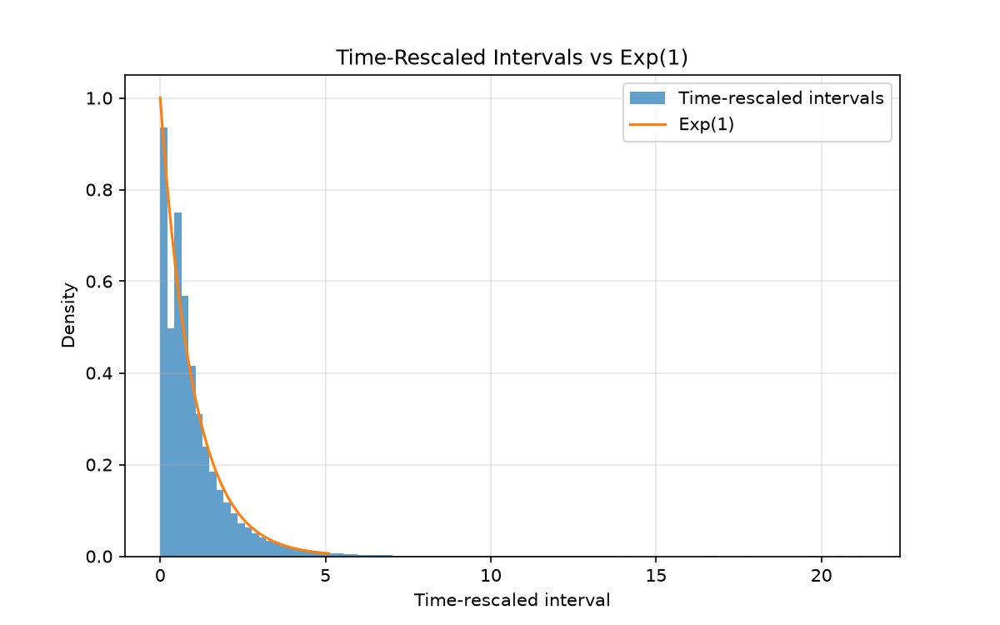
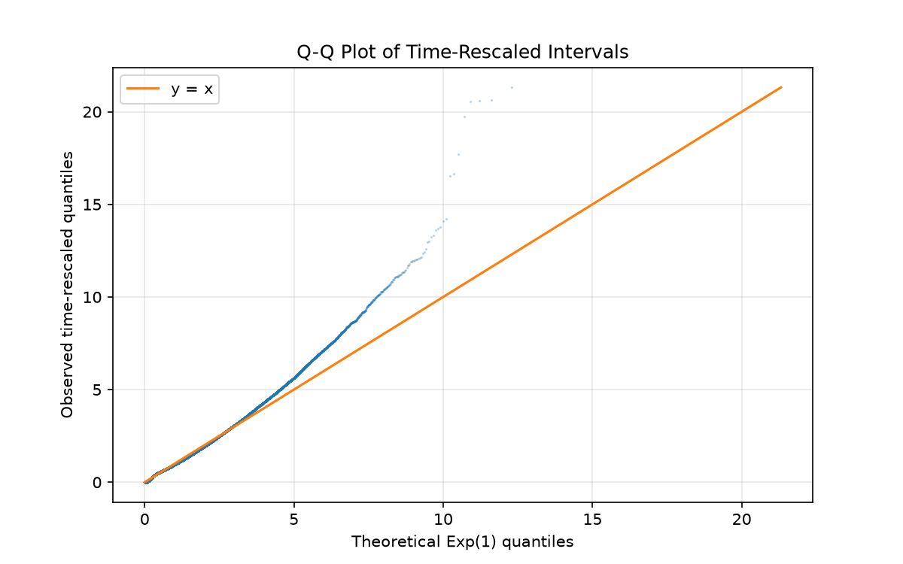
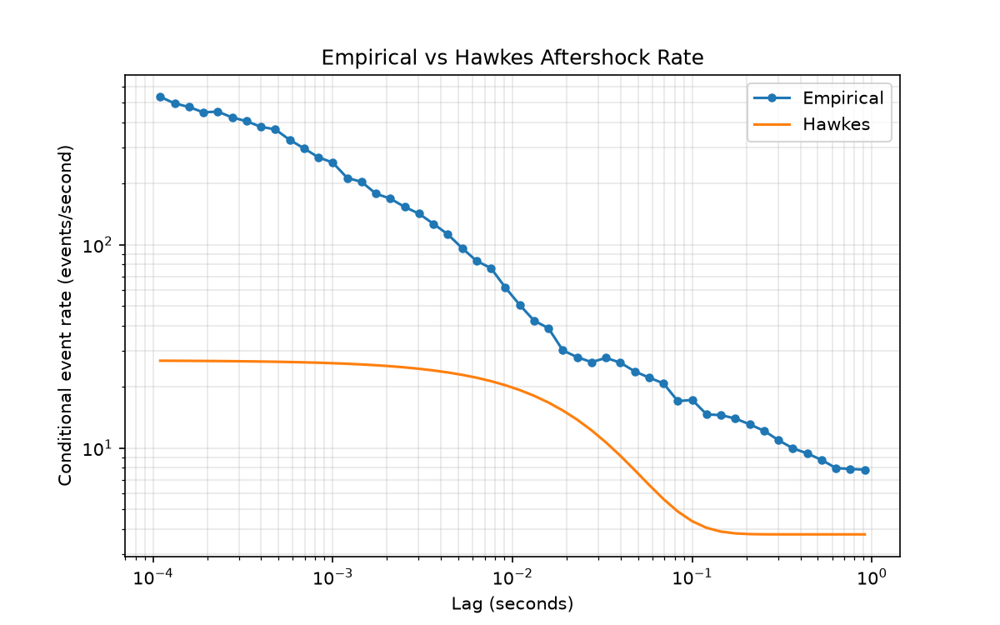
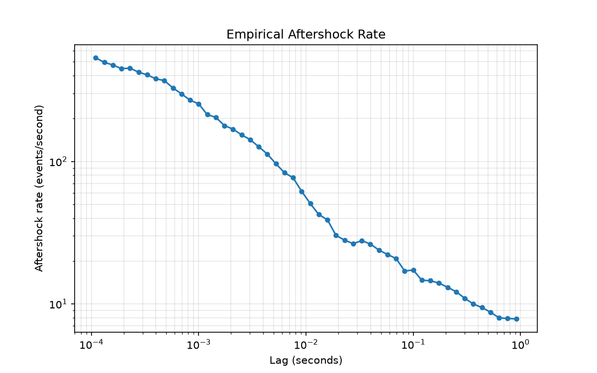
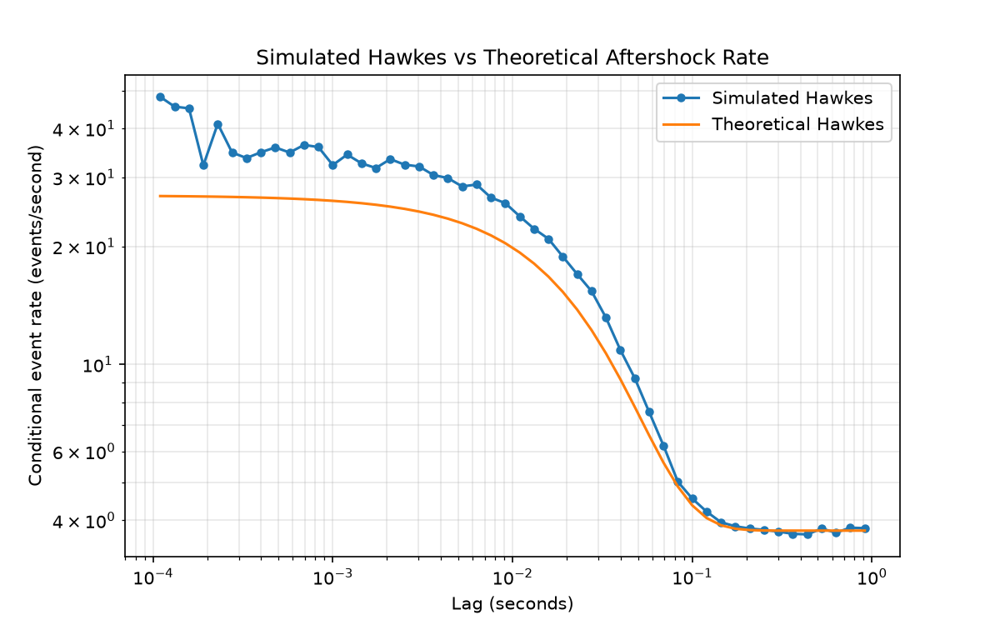
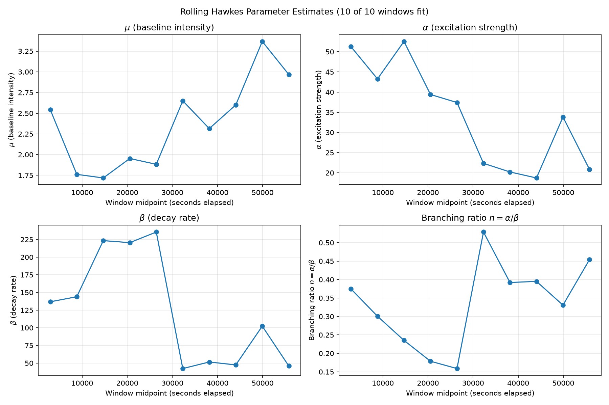

# Market Order Self-Excitation with Hawkes Processes

A quantitative finance research project studying the temporal structure, clustering, and self-excitation of trade arrivals using **Poisson and Hawkes point processes**.

The central question is:

> **Does the arrival of one aggressive (market) order increase the probability of subsequent orders?**

The project begins by testing whether trade arrivals can reasonably be modeled as a homogeneous Poisson process. When the empirical data exhibits clustering and temporal dependence inconsistent with the Poisson assumption, a **Hawkes process** is introduced to model the resulting self-excitation.

> **A note on terminology.** The data used here is Binance's `trades` dataset: one row is one trade **execution**, not necessarily one market order — a single large aggressive order can fill against several resting counterparties and generate multiple trade rows at the same (or nearly the same) timestamp. This is not a minor caveat: [Robustness to Event Definition](#robustness-to-event-definition) finds that **83.5% of trades share an exact microsecond timestamp with another trade**, almost certainly reflecting exactly this. Where this README says "market order" it means "aggressive trade execution, aggregated to the unique-timestamp event definition unless stated otherwise" — the more precise phrasing throughout the analysis sections below.

---

## Key Results

- Analyzed 221,114 unique trade-arrival events (from the first 1,000,000 raw BTC/USDT trades, ≈16.3 hours, January 2025).
- The homogeneous-Poisson hypothesis is decisively rejected: Fano factors up to ≈136 (vs. 1 for Poisson), autocorrelation ≈0.42 at lag 1 decaying to ≈0.21 at lag 20 (corrected — see below), and a >143,000-point log-likelihood gap in favor of Hawkes.
- **Fitted exponential-kernel Hawkes:** `mu=2.301, alpha=23.226, beta=59.769` → branching ratio **n ≈ 0.389** (95% CI ±0.003), excitation half-life **≈11.6ms**.
- **Out-of-sample:** Hawkes beats Poisson on held-out log-likelihood on a chronological 70/30 split (1.12 vs 0.52 per event) and in **every** rolling block-fold — not just in-sample.
- **Nonstationary:** the branching ratio drifts over the sample (block-to-block std ≈57× larger than sampling-noise-only uncertainty) — a single time-homogeneous fit understates the real picture.
- **Buy/sell bivariate model:** same-side excitation (buy→buy ≈0.34, sell→sell ≈0.41) is ≈43× stronger than cross-side excitation (≈0.008–0.01) — self-excitation here is overwhelmingly a same-side, order-splitting-like phenomenon, though a likelihood-ratio test confirms the small cross-side effect is real (p ≈ 1e-141), not just noise.
- **Power-law kernel extension:** wins on AIC/BIC, but its fitted shape converges to mimic the exponential kernel's own decay timescale — nonstationarity, not kernel shape, looks like the more likely remaining source of misfit.
- Recursive O(n) intensity calculation is up to 124× faster than the direct O(n²) implementation at 20,000 events, and is what makes fitting this model on 200k+ events tractable at all.
- **Two real bugs found via external review and fixed** (with regression tests added): an autocorrelation calculation that silently multiplied observations by themselves due to pandas index alignment (previously reported ≈0.999 at every lag; true value ≈0.42 decaying to ≈0.21), and a Fano-factor calculation that leaked a partial trailing window into the variance/mean estimate.

See [Current Findings](#current-findings) and [Research Interpretation](#research-interpretation) for the full picture, or jump straight to any section below.

---

## Table of Contents

- [Research Motivation](#research-motivation)
- [Objectives](#objectives)
- [Data](#data)
- [Project Structure](#project-structure)
- [Data Processing](#data-processing)
- [Poisson Baseline](#poisson-baseline)
- [Inter-Arrival Times](#inter-arrival-times)
- [Coefficient of Variation](#coefficient-of-variation)
- [Event Counts and Fano Factor](#event-counts-and-fano-factor)
- [Autocorrelation](#autocorrelation)
- [Windowed Event Intensity](#windowed-event-intensity)
- [Hawkes Process](#hawkes-process)
- [Current Hawkes Implementation](#current-hawkes-implementation)
- [Initial Hawkes Example](#initial-hawkes-example)
- [Parameter Estimation and Goodness-of-Fit](#parameter-estimation-and-goodness-of-fit)
- [Order-Flow Aftershocks](#order-flow-aftershocks)
- [Nonstationarity](#nonstationarity)
- [Robustness to Event Definition](#robustness-to-event-definition)
- [Robustness Across Time Windows](#robustness-across-time-windows)
- [Power-Law Kernel Extension](#power-law-kernel-extension)
- [Three-Way Model Comparison](#three-way-model-comparison)
- [Stability-Constrained, Multi-Start Optimization](#stability-constrained-multi-start-optimization)
- [Out-of-Sample Evaluation](#out-of-sample-evaluation)
- [Parameter Uncertainty](#parameter-uncertainty)
- [Buy/Sell Bivariate Hawkes Model](#buysell-bivariate-hawkes-model)
- [Current Findings](#current-findings)
- [Methodology](#methodology)
- [Next Steps](#next-steps)
- [Research Interpretation](#research-interpretation)
- [Development](#development)
- [Disclaimer](#disclaimer)

---

## Research Motivation

In a homogeneous Poisson process, events arrive independently at a constant rate:

$$
\lambda(t) = \mu
$$

where $\mu$ is the baseline event intensity.

Financial markets, however, often exhibit **order clustering**. A burst of trading activity can be followed by additional orders arriving at high frequency before activity eventually decays.

This behavior suggests that the probability of an order arriving may depend on previous orders.

A Hawkes process captures this behavior through a time-varying intensity:

$$
\lambda(t) = \mu + \sum_{t_i < t} \alpha e^{-\beta(t-t_i)}
$$

where:

| Symbol | Meaning |
|---|---|
| $\mu$ | Baseline intensity |
| $\alpha$ | Excitation strength |
| $\beta$ | Decay rate |
| $t_i$ | Previous event times |

Each previous event temporarily increases the intensity, with its effect decaying exponentially over time.

---

## Objectives

The project is being developed in stages:

1. Load and process high-frequency trade data.
2. Extract unique market-order event times.
3. Calculate inter-arrival times.
4. Establish a homogeneous Poisson baseline.
5. Test the exponential inter-arrival assumption.
6. Measure dispersion using the coefficient of variation.
7. Measure event clustering using the Fano factor.
8. Analyze temporal dependence using autocorrelation.
9. Construct windowed event-count and intensity series.
10. Implement a Hawkes-process intensity.
11. Estimate Hawkes parameters from the observed data.
12. Evaluate whether the Hawkes model better explains market-order clustering.

---

## Data

The current analysis uses Binance BTC/USDT trade data:

```text
BTCUSDT-trades-2025-01.csv
```

The raw data contains fields including:

- `trade_id`
- `price`
- `quantity`
- `quote_quantity`
- `timestamp_us`
- `is_buyer_maker`
- `is_best_match`

For the current experiments, the first **1,000,000 trades** are loaded.

---

## Project Structure

```text
hawkes-market-microstructure/
│
├── data/
│   └── BTCUSDT-trades-2025-01.csv
│
├── src/
│   ├── data_loader.py
│   ├── trade_processing.py
│   ├── poisson.py
│   ├── poisson_diagnostics.py
│   └── hawkes.py
│
├── README.md
└── ...
```

| File | Description |
|---|---|
| `data_loader.py` | Responsible for loading the raw trade data into a pandas DataFrame. |
| `trade_processing.py` | Handles timestamp conversion and basic event-time processing. |
| `poisson.py` | Provides the basic homogeneous Poisson intensity estimate. |
| `poisson_diagnostics.py` | Contains the statistical diagnostics used to evaluate whether the observed event process resembles a Poisson process. |
| `hawkes.py` | Exponential-kernel Hawkes intensity, MLE fitting, log-likelihood, branching ratio/stability, simulation, and goodness-of-fit (time-rescaling, KS test, Q-Q plot). |
| `aftershock_analysis.py` | Empirical vs. theoretical conditional event-rate ("aftershock") analysis at multiple lags. |
| `model_comparison.py` | Poisson vs. exponential-Hawkes vs. power-law-Hawkes comparison via log-likelihood, AIC, and BIC. |
| `nonstationarity.py` | Rolling-window Hawkes parameter stability check (is the process stationary?). |
| `event_definition_robustness.py` | Refits the Hawkes model under alternative definitions of an "event". |
| `time_window_robustness.py` | Refits the Hawkes model on independent time blocks to check the headline finding replicates. |
| `power_law_hawkes.py` | Power-law (Omori-Utsu) kernel Hawkes model: intensity, truncated log-likelihood, MLE fitting. |
| `out_of_sample.py` | Chronological train/test split and rolling block-fold held-out log-likelihood evaluation. |
| `parameter_uncertainty.py` | Asymptotic (Hessian-based) and block-based (model-free) uncertainty estimates for the fitted parameters. |
| `bivariate_hawkes.py` | Buy/sell bivariate Hawkes model with a 2×2 excitation matrix and shared decay rate. |

---

## Data Processing

### Timestamp Conversion

The raw timestamps are provided in Unix microseconds. They are converted to UTC timestamps:

```python
data["timestamp"] = pd.to_datetime(
    data["timestamp_us"],
    unit="us",
    utc=True
)
```

Inter-arrival times are calculated as:

$$
\Delta t_i = t_i - t_{i-1}
$$

and converted from microseconds to seconds:

$$
\Delta t_{\text{seconds}} = \frac{\Delta t_{\text{microseconds}}}{10^6}
$$

### Event-Time Extraction

The analysis uses unique, chronologically ordered event timestamps. The processing pipeline:

1. Remove missing timestamps.
2. Remove duplicate timestamps.
3. Sort chronologically.
4. Reset the index.

This produces the event sequence

$$
t_1, t_2, \ldots, t_N
$$

used throughout the point-process analysis.

---

## Poisson Baseline

Before introducing self-excitation, the project establishes a homogeneous Poisson baseline.

For a Poisson process with constant intensity $\lambda$, the maximum-likelihood estimate is:

$$
\hat{\lambda} = \frac{N-1}{T}
$$

where

$$
T = t_N - t_1
$$

is the total observation time. The estimated intensity is expressed in events/second.

For the current dataset:

```text
Poisson intensity ≈ 3.764 events/second
```

The mean inter-arrival time is:

```text
≈ 0.265674 seconds
```

which agrees with:

$$
E[\Delta t] = \frac{1}{\lambda}
$$

and therefore:

```text
1 / λ ≈ 0.265674 seconds
```

This agreement is an **algebraic identity, not an empirical test of the Poisson assumption**: the estimator itself is $\hat\lambda = N/\sum_i \Delta t_i = 1/\overline{\Delta t}$, so $1/\hat\lambda \equiv \overline{\Delta t}$ by construction. It confirms the intensity estimator was implemented correctly, but it says nothing about whether inter-arrival times are actually exponentially distributed — that question is addressed separately below (coefficient of variation, Fano factor, autocorrelation, and ultimately the Hawkes goodness-of-fit tests).

---

## Inter-Arrival Times

For a homogeneous Poisson process, inter-arrival times follow an exponential distribution:

$$
f(x) = \lambda e^{-\lambda x}, \qquad x \geq 0
$$

The project compares the empirical distribution of observed inter-arrival times with this theoretical exponential distribution. Both the empirical vs. theoretical PDF and the empirical vs. theoretical CDF are examined.

The empirical CDF is constructed as:

$$
\hat F(x) = \frac{1}{N} \sum_{i=1}^{N} \mathbf{1}(\Delta t_i \leq x)
$$

---

## Coefficient of Variation

The coefficient of variation (CV) provides a scale-independent measure of dispersion:

$$
CV = \frac{\sigma_{\Delta t}}{\mu_{\Delta t}}
$$

For an exponential distribution:

$$
CV = 1
$$

Therefore, a value substantially different from 1 provides evidence that the inter-arrival process does not behave like an ideal Poisson process. The project calculates the CV of the observed inter-arrival times as part of the Poisson diagnostics.

---

## Event Counts and Fano Factor

To study clustering over different time scales, event times are divided into fixed windows of width $\Delta$. For each window:

$$
N_k = \text{number of events in window } k
$$

This produces an event-count time series:

```text
[0, 10)       143
[10, 20)      152
[20, 30)      125
[30, 40)       77
...
```

For a Poisson process, the number of events in a fixed interval follows:

$$
N(\Delta) \sim \text{Poisson}(\lambda \Delta)
$$

and therefore:

$$
E[N] = Var(N)
$$

The Fano factor is:

$$
F = \frac{Var(N)}{E[N]}
$$

For an ideal Poisson process, $F = 1$. Values substantially larger than 1 indicate **over-dispersion and clustering**.

### Observed Fano Factors

| Window Size (s) | Fano Factor |
| ---: | ---: |
| 1 | 13.09 |
| 2 | 17.30 |
| 5 | 25.30 |
| 10 | 36.44 |
| 20 | 53.22 |
| 50 | 84.72 |
| 100 | 136.49 |

The Fano factor is far above the Poisson benchmark of 1 across the tested window sizes. This provides strong evidence that the event process exhibits substantial clustering and is not well described by a homogeneous Poisson process.

> **Bug fix note:** `calculate_fano_factor` originally computed `num_windows` as the number of *complete* windows, but then let `np.bincount` include one extra, shorter trailing window whenever the observation period wasn't an exact multiple of the window size (`bincount`'s `minlength` only sets a floor on the output length, not a ceiling). That partial window was silently mixed into the mean/variance as if it had full exposure. The fix explicitly drops any event falling in an incomplete trailing window before counting. The effect on the numbers above is small (this dataset's overdispersion is real and large regardless), but the calculation is now correct on principle rather than by luck.

---

## Autocorrelation

The event-count series is also analyzed for temporal dependence. For lag $k$, the autocorrelation measures the relationship between $N_t$ and $N_{t+k}$.

The current implementation calculates:

$$
\rho_k = \frac{\gamma_k}{\gamma_0}
$$

where $\gamma_k$ is the lag-$k$ autocovariance. A simpler pandas-based alternative is also provided:

```python
event_count_series.autocorr(lag=lag)
```

### Observed Autocorrelation

Using a 10-second event-count window:

```text
Lag  1: 0.422847
Lag  2: 0.312611
Lag  3: 0.279525
Lag  4: 0.260677
Lag  5: 0.279552
...
Lag 10: 0.208720
...
Lag 20: 0.206414
```

The event-count series exhibits substantial positive temporal dependence, decaying from ≈0.42 at lag 1 to ≈0.21 by lag 20 rather than vanishing. This is inconsistent with independent Poisson increments and further motivates the use of a self-exciting point process.

> **Bug fix note:** the values previously reported here (≈0.999 at every lag from 1 to 20) were wrong. `event_count_series` is a pandas `Series` indexed by `IntervalIndex` (one interval per window), and `calculate_autocorrelation` sliced it with `series[:-lag]` / `series[lag:]` and then multiplied the two slices directly. Pandas arithmetic between two `Series` aligns by **index label**, not by position — so wherever the two slices' `IntervalIndex` labels overlapped, the code was effectively computing `(X_i - mean) * (X_i - mean)` instead of `(X_i - mean) * (X_{i+lag} - mean)`, which is why the result was close to `Var(X)/Var(X) ≈ 1` at every lag regardless of the actual data. Verified on synthetic i.i.d. Poisson counts (true autocorrelation ≈ 0 at every lag): the old code reported ≈0.998 at every lag; converting to a plain NumPy array before the arithmetic (avoiding the label-based alignment entirely) recovers the correct near-zero result. The real BTCUSDT numbers above are from the corrected implementation.

---

## Windowed Event Intensity

The event-count series can be converted into an empirical intensity series. For a window of width $\Delta$:

$$
\hat{\lambda}_k = \frac{N_k}{\Delta}
$$

where $N_k$ is the number of events observed in window $k$. The resulting series represents the observed event intensity over time, allowing periods of elevated and reduced trading activity to be visualized directly.

---

## Hawkes Process

The project then moves from a constant-intensity Poisson model to a self-exciting Hawkes process. The Hawkes intensity is:

$$
\lambda(t) = \mu + \sum_{t_i < t} \alpha e^{-\beta(t-t_i)}
$$

| Parameter | Role |
|---|---|
| $\mu$ (baseline intensity) | Background rate of events in the absence of recent activity |
| $\alpha$ (excitation parameter) | Controls how strongly each previous event increases future intensity |
| $\beta$ (decay parameter) | Controls how quickly the effect of a previous event disappears — a larger $\beta$ means faster decay |

---

## Current Hawkes Implementation

The current implementation evaluates:

```python
def hawkes_intensity(t, event_times, mu, alpha, beta):

    past_events = event_times[event_times < t]

    intensity = (
        mu
        + np.sum(
            alpha * np.exp(
                -beta * (t - past_events)
            )
        )
    )

    return intensity
```

For every time $t$, the function:

1. Finds all previous events.
2. Calculates the contribution of each previous event.
3. Applies exponential decay.
4. Adds all contributions to the baseline intensity.

The project also constructs an intensity series $\lambda(t_1), \lambda(t_2), \ldots, \lambda(t_N)$ and stores the result in a DataFrame containing:

```text
timestamp | intensity
```

---

## Initial Hawkes Example

For the initial implementation, the following parameters are used:

```python
mu = 1.0
alpha = 0.5
beta = 1.0
```

with example event times:

```python
event_times = np.array([1.0, 2.0, 4.0])
```

At a time $t = 5$:

$$
\lambda(5) = 1 + 0.5e^{-1(5-1)} + 0.5e^{-1(5-2)} + 0.5e^{-1(5-4)}
$$

which produces the corresponding Hawkes intensity.

> **Note:** These parameters are currently **illustrative** and have not yet been estimated from the market data.

---

## Parameter Estimation and Goodness-of-Fit

The exponential-kernel Hawkes model is fit to the full 1,000,000-trade subset (221,114 unique event times, spanning ≈58,744 seconds ≈16.32 hours) by maximum likelihood (`src/hawkes.py`):

```text
mu    = 2.301353
alpha = 23.225818
beta  = 59.767895
branching ratio n = alpha / beta = 0.3886   (stable, n < 1)
```

Compared to the raw Poisson log-likelihood (71,970.31), the Hawkes log-likelihood (215,109.04) is dramatically higher — a difference of over 143,000 — despite adding only 2 extra parameters.

**Goodness-of-fit via the time-rescaling theorem.** If the fitted intensity $\lambda(t)$ is correct, the rescaled inter-event intervals $\tau_i = \int_{t_{i-1}}^{t_i}\lambda(s)\,ds$ should behave like i.i.d. Exp(1) draws. Comparing the observed rescaled intervals to Exp(1):

- KS statistic ≈ 0.0578, KS p-value ≈ 0.0 — formally rejects the exponential null (expected at this sample size; even small deviations are statistically detectable with 221k observations).
- Residual autocorrelation of the rescaled intervals decays slowly rather than vanishing: lag 1 ≈ 0.227, lag 10 ≈ 0.136, lag 20 ≈ 0.109.
- As a control, intervals rescaled from data *simulated directly from the fitted model* show essentially zero autocorrelation (lag 1 ≈ 0.007), confirming the residual autocorrelation in the real data is a genuine model-misspecification signal, not an artifact of the rescaling procedure itself.




**Interpretation:** the single-exponential-kernel Hawkes model is a massive improvement over Poisson, but it does not fully whiten the event stream — some temporal structure remains unexplained by a single, time-homogeneous exponential kernel. The nonstationarity and power-law kernel checks below directly follow up on this residual structure.

---

## Order-Flow Aftershocks

`src/aftershock_analysis.py` measures the empirical conditional event rate at lags from 0.1 ms to 1 s after each event (log-spaced bins) and compares it against the rate implied by the fitted exponential-kernel Hawkes model.





As an internal consistency check, the same comparison is repeated on data *simulated* from the fitted model against its own theoretical rate: the mean absolute log-error there is only ≈0.19 (pure simulation noise), whereas the mean absolute log-error between the **real** empirical rate and the theoretical rate is ≈1.60 — roughly an e^1.6 ≈ 5× average discrepancy in conditional rate. The real aftershock decay shape is measurably different from what a single exponential kernel predicts, again pointing toward either a richer kernel shape or genuine nonstationarity (or both).

---

## Nonstationarity

`src/nonstationarity.py` tests whether a single, time-homogeneous exponential Hawkes model is even appropriate by independently re-fitting mu, alpha, beta in K equal-width, non-overlapping sub-windows of the observation period (K=10 and K=20, as a robustness-of-the-robustness-check), each fit treated as its own standalone point process.



With K=10 windows (each ≈1.63 hours):

| Window | n_events | mu | alpha | beta | branching ratio |
|---:|---:|---:|---:|---:|---:|
| 0 | 23,878 | 2.542 | 51.254 | 136.815 | 0.375 |
| 1 | 14,788 | 1.762 | 43.269 | 143.971 | 0.301 |
| 2 | 13,196 | 1.718 | 52.560 | 223.422 | 0.235 |
| 3 | 13,969 | 1.953 | 39.410 | 220.524 | 0.179 |
| 4 | 13,147 | 1.883 | 37.423 | 235.581 | 0.159 |
| 5 | 33,037 | 2.650 | 22.350 | 42.260 | 0.529 |
| 6 | 22,360 | 2.315 | 20.215 | 51.562 | 0.392 |
| 7 | 25,250 | 2.600 | 18.730 | 47.404 | 0.395 |
| 8 | 29,558 | 3.368 | 33.834 | 102.295 | 0.331 |
| 9 | 31,931 | 2.968 | 20.865 | 45.960 | 0.454 |

Correlation between elapsed time and each parameter: mu **r = +0.71**, alpha **r = −0.83**, beta **r = −0.62**, branching ratio **r = +0.42** (all but branching ratio exceed the |r| > 0.5 rule-of-thumb for a systematic trend rather than sampling noise). Coefficients of variation across windows: mu 0.23, alpha 0.38, beta 0.63, branching ratio 0.35. The K=20 run reproduces the same pattern (mu r=+0.64, alpha r=−0.66, beta r=−0.57).

**Interpretation:** the process is **not stationary** over this ≈16-hour sample. The three parameters do not all move together: the baseline intensity **mu tends to increase** over the sample (r = +0.71 — more background activity later on), while the **excitation amplitude alpha and decay rate beta both decline** (r = −0.83, r = −0.62 — each individual excitation episode becomes weaker but longer-lived). Pooling the full sample into one exponential fit averages over this drift, which is a direct, testable explanation for the residual autocorrelation and aftershock-rate mismatch found above.

---

## Robustness to Event Definition

`src/event_definition_robustness.py` checks whether the conclusions above depend on how an "event" is defined. Three definitions are compared on the same underlying 1,000,000-trade subset:

| Definition | n_events | mu | alpha | beta | branching ratio | stable |
|---|---:|---:|---:|---:|---:|---:|
| (a) unique timestamps [baseline] | 221,114 | 2.301 | 23.226 | 59.768 | 0.389 | ✓ |
| (b) all trades, jittered | 1,000,000 | 3.752 | 3,247,764.7 | 4,298,252.2 | 0.756 | ✓ |
| (c) 1 ms burst-aggregated | 202,170 | 1.970 | 7.630 | 17.840 | 0.428 | ✓ |

**83.5%** of trades share an exact microsecond timestamp with at least one other trade. An identical microsecond timestamp cannot, by itself, prove two rows came from the same taker order — independent trades can also collide at this resolution — but the sheer scale of this fraction is consistent with a substantial contribution from individual aggressive orders generating multiple trade executions against resting liquidity, rather than independent arrivals. Definition (b) treats every one of these as its own event (nudged apart by 1 ns to preserve a strict ordering), and the fit reacts by pushing alpha and beta to extreme values that essentially model near-simultaneous same-timestamp fills as an almost-instantaneous, near-delta-function excitation burst.

**Interpretation:** self-excitation (alpha > 0) and stability (n < 1) hold under every definition, so the qualitative claim — market orders excite subsequent arrivals — is robust. The *quantitative* branching ratio is not: it ranges from 0.39 to 0.76 (a 70% relative spread) depending on how same-timestamp trades are treated. Part of the "self-excitation" signal at the finest timescale is attributable to trade-level order splitting rather than genuine cross-order causal excitation, and the baseline (a) and burst-aggregated (c) definitions — which collapse same-timestamp fills into one event — are the more defensible choices for interpreting the branching ratio as market-order self-excitation.

---

## Robustness Across Time Windows

`src/time_window_robustness.py` asks a different question from the nonstationarity check above: rather than looking for a *trend*, it tests whether the *headline finding* (Hawkes beats Poisson; the process is stable) *replicates* across a few large, independent chunks of data, using the same 5-block partition of the observation period (≈3.26 hours per block).

| Block | Span (h) | n_events | mu | alpha | beta | branching ratio | Poisson AIC | Hawkes AIC | Hawkes wins |
|---:|---:|---:|---:|---:|---:|---:|---:|---:|---:|
| 0 | 3.26 | 38,666 | 2.140 | 46.896 | 134.051 | 0.350 | −14,800.5 | −76,620.8 | ✓ |
| 1 | 3.26 | 27,165 | 1.834 | 45.570 | 220.528 | 0.207 | 8,793.0 | −17,677.2 | ✓ |
| 2 | 3.26 | 46,184 | 2.172 | 19.550 | 43.686 | 0.448 | −34,074.1 | −103,537.0 | ✓ |
| 3 | 3.26 | 47,610 | 2.455 | 19.387 | 49.195 | 0.394 | −38,020.8 | −90,428.5 | ✓ |
| 4 | 3.26 | 61,489 | 3.096 | 23.684 | 57.969 | 0.409 | −80,561.8 | −151,964.3 | ✓ |

Every block is stable and Hawkes beats Poisson by both AIC and BIC in every block. The branching ratio still ranges from 0.21 to 0.45 across blocks (66.7% relative spread) — consistent with, and reinforcing, the drift found in the nonstationarity check.

**Interpretation:** the qualitative conclusion (self-exciting, stable, Hawkes ≫ Poisson) replicates reliably regardless of which slice of the day is used; only the precise magnitude of the excitation is time-varying.

---

## Power-Law Kernel Extension

`src/power_law_hawkes.py` replaces the exponential kernel with an Omori–Utsu-style power-law kernel:

$$
g(t) = \frac{\alpha}{(t + c)^p}, \qquad t \ge 0,\ c > 0,\ p > 1
$$

with branching ratio $n = \alpha c^{1-p} / (p-1)$. Because the power-law kernel has no exponential-family Markov shortcut, the log-intensity term is computed with a 5-second lookback truncation (several hundred times the exponential kernel's decay timescale, and comfortably beyond the 0.1 ms–1 s lag range where `aftershock_analysis.py` finds excitation concentrated); this precomputes ~8.17 million (event, prior-event) pairs once, in ≈0.1 s, making the full-sample MLE fit (no subsampling needed) complete in ≈26 seconds.

Fitted on the same full 221,114-event series:

```text
mu    = 2.291031
alpha = 92.607775
c     = 1.022935
p     = 61.295099
branching ratio n = 0.3914   (stable, n < 1)
```

The fitted `p ≈ 61.3` is large enough that `g(5s)/g(0) ≈ 6.4 × 10⁻⁴⁸` — the truncation window is enormously conservative for these parameters. More importantly, a decay exponent this large means the power-law kernel's implied half-life (≈0.0117 s) is **almost identical to the exponential kernel's own half-life** (ln 2 / beta ≈ 0.0116 s): the extra shape parameter did not converge to a genuinely fat, slowly-decaying tail — it converged to a shape that closely mimics the single-exponential decay already found.

---

## Three-Way Model Comparison

`src/model_comparison.py` compares Poisson, exponential-kernel Hawkes, and power-law-kernel Hawkes on the same full dataset:

| Model | Params | Log-likelihood | AIC | BIC | Branching ratio |
|---|---:|---:|---:|---:|---:|
| Poisson | 1 | 71,970.31 | −143,938.62 | −143,928.32 | — |
| Exponential Hawkes | 3 | 215,109.04 | −430,212.09 | −430,181.17 | 0.3886 |
| Power-law Hawkes | 4 | 215,389.87 | **−430,771.75** | **−430,730.52** | 0.3914 |

The power-law model wins by both AIC and BIC — but given the near-identical decay timescale noted above, this ≈281-point log-likelihood gain (for one extra parameter) mainly reflects a marginally better-fitting *shape* at very short lags, not evidence of genuinely fat-tailed, slowly-decaying order-flow aftershocks. Combined with the nonstationarity findings, the more likely explanation for any remaining lack of fit is a **time-varying baseline/excitation** rather than a wrong kernel *shape* — a natural direction for future work (see [Next Steps](#next-steps)).

---

## Stability-Constrained, Multi-Start Optimization

The original MLE routine in `src/hawkes.py` enforced `mu > 0`, `alpha >= 0`, `beta > 0` via box constraints, but did **not** constrain the stability condition `n = alpha / beta < 1` during optimization — stability was only checked after the fact. `estimate_hawkes_parameters` now optimizes in an unconstrained reparameterization:

```text
mu    = exp(log_mu)
beta  = exp(log_beta)
n     = sigmoid(logit_n)        # guaranteed in (0, 1)
alpha = n * beta                # so alpha / beta = n < 1 by construction
```

from a small grid of 3 initial guesses (`n0 ∈ {0.2, 0.5, 0.8}`), keeping whichever converged fit has the lowest negative log-likelihood, and requiring only a finite objective value rather than gating on scipy's `success` flag (BFGS frequently reports `success=False` with a benign "precision loss" message right at a sharp, well-conditioned optimum — gating on it would discard good fits). Every existing caller is unaffected: `.x` is still `[mu, alpha, beta]` in the original, interpretable units.

On the full dataset this converges to `mu=2.301358, alpha=23.226112, beta=59.768948` — matching the original single-start fit to 5+ significant figures, confirming this dataset has one well-separated dominant optimum. The value of the change is guaranteed stability by construction (relevant for the smaller sub-window/block fits elsewhere in this README) rather than a different headline number.

---

## Out-of-Sample Evaluation

`src/out_of_sample.py` addresses a gap in the analysis so far: every comparison above fits and evaluates the model on the *same* data. This module fits on one period and scores held-out log-likelihood on a **later, unseen** period, correctly carrying the fitted excitation state across the train/test boundary (a test-period event just after the split does not start from zero intensity — it still inherits decayed excitation from training-period events, via a closed-form extension of the integrated-intensity formula).

**70/30 chronological split** (train on the first 70% of the observation period, test on the last 30%):

```text
train events: 134,375   test events: 86,738
mu=2.070, alpha=25.763, beta=70.278, branching ratio=0.367 (stable)

Held-out log-likelihood per test event:
  Hawkes:  1.1224
  Poisson: 0.5202
```

**Rolling block folds** (fit on block *i*, test on block *i+1*, reusing the 5-block partition from [Robustness Across Time Windows](#robustness-across-time-windows)):

| Fold | Train block | Test block | Hawkes LL/event | Poisson LL/event | Hawkes wins |
|---:|---:|---:|---:|---:|---:|
| 0 | 0 | 1 | 0.283 | −0.232 | ✓ |
| 1 | 1 | 2 | 0.989 | 0.250 | ✓ |
| 2 | 2 | 3 | 0.945 | 0.399 | ✓ |
| 3 | 3 | 4 | 1.223 | 0.625 | ✓ |

Hawkes beats Poisson out-of-sample in the chronological split and in **every** rolling fold. This is a materially stronger claim than the earlier in-sample AIC/BIC comparison: the model's predictive edge survives on genuinely unseen future data, not just data it was fit to.

---

## Parameter Uncertainty

`src/parameter_uncertainty.py` reports two complementary uncertainty estimates for the fitted exponential-kernel Hawkes parameters, since a bare point estimate (as used everywhere else in this README) doesn't convey how precisely — or for what reason — that number is known.

**Asymptotic (Hessian-based) standard errors**, from inverting a numerically-estimated Hessian of the negative log-likelihood at the MLE and applying the delta method to derived quantities:

```text
mu               = 2.301358 +/- 0.014202  (95% CI)
alpha            = 23.226112 +/- 0.393293 (95% CI)
beta             = 59.768948 +/- 1.151352 (95% CI)
branching ratio  = 0.388598 +/- 0.003219  (95% CI)
half-life        = 0.011597 +/- 0.000223  (95% CI, seconds)
```

**Block-based (model-free) spread**, from the standard deviation of the branching ratio across the 5 independent time blocks used elsewhere:

```text
Branching ratio across 5 blocks: mean=0.361, std=0.093
Asymptotic sampling-noise-only SE: 0.0016
Ratio: 57x
```

The block-to-block spread is **≈57× larger** than the asymptotic sampling-noise SE. This is the quantitative confirmation of the [Nonstationarity](#nonstationarity) finding: the branching ratio's true uncertainty is dominated by genuine drift over time, not by how precisely a single time-homogeneous fit can be estimated. Reporting only the Hessian-based CI — which is what most textbook treatments stop at — would understate the real uncertainty in this number by more than an order of magnitude.

---

## Buy/Sell Bivariate Hawkes Model

Every model up to this point pools all trades into one stream. `src/bivariate_hawkes.py` splits trades by aggressor side using `is_buyer_maker`:

```text
is_buyer_maker == False -> the buyer is the taker -> buy-initiated trade
is_buyer_maker == True  -> the seller is the taker -> sell-initiated trade
```

and fits a bivariate exponential-kernel Hawkes model with a 2×2 excitation matrix (one shared decay rate `beta` across all four kernels, for computational tractability — see the module docstring):

$$
\lambda_B(t) = \mu_B + \alpha_{BB}\!\!\sum_{t_j^B<t} e^{-\beta(t-t_j^B)} + \alpha_{BS}\!\!\sum_{t_j^S<t} e^{-\beta(t-t_j^S)}
$$

$$
\lambda_S(t) = \mu_S + \alpha_{SB}\!\!\sum_{t_j^B<t} e^{-\beta(t-t_j^B)} + \alpha_{SS}\!\!\sum_{t_j^S<t} e^{-\beta(t-t_j^S)}
$$

Fitted on the same 1,000,000-trade subset (106,946 buy-initiated events, 114,231 sell-initiated events, ≈48.4%/51.6% split):

```text
mu_B = 1.190, mu_S = 1.122
alpha_BB = 18.477, alpha_BS = 0.423, alpha_SB = 0.541, alpha_SS = 22.596
beta = 54.645 (shared)
```

> **Bug fix note.** Buy and sell timestamps are deduplicated independently, so a buy-initiated and a sell-initiated trade can legitimately share the exact same microsecond timestamp (63 such ties exist in this dataset). The merged buy/sell timeline used to process events strictly one at a time in concatenation order, so whichever side happened to be concatenated first would spuriously appear to excite the simultaneous event on the other side at Δt=0 — an arbitrary, asymmetric artifact rather than a real effect. The fix processes every tie group as a batch (all tied events see the same pre-group state; none of them see each other), verified both on a hand-built example and with a regression test. The effect on the fitted parameters is, as expected given only 63/221k+ events are affected, negligible (e.g. alpha_SB moves from 0.561 to 0.541); both starting points (`beta0 ∈ {10, 60}`) converge to the same optimum to 8+ significant figures, confirming this is a well-identified global optimum rather than an artifact of either fix.

Branching matrix (row = triggered side, column = triggering side) and its spectral radius:

| | Buy (source) | Sell (source) |
|---|---:|---:|
| **Buy (target)** | 0.3381 | 0.0077 |
| **Sell (target)** | 0.0099 | 0.4135 |

Spectral radius ≈ 0.415 (stable). Average same-side excitation (0.376) is **≈43× larger** than average cross-side excitation (0.0088).

**Is that cross-side excitation statistically real, or just an artifact of a parameterization that can't represent exactly zero?** Since `alpha_BS, alpha_SB` are fit in log-space, the optimizer can never return exactly 0 for them even if the true value were zero. To test this honestly, `test_cross_excitation_significance` fits a restricted model with `alpha_BS = alpha_SB = 0` fixed and compares it to the unrestricted model via a likelihood-ratio test:

```text
H0: alpha_BS = alpha_SB = 0
Full model log-likelihood:       97222.02
Restricted model log-likelihood: 96899.62
LR statistic (df=2):             644.81
p-value:                         9.6e-141
```

The unrestricted model fits overwhelmingly better — the small cross-side excitation is **statistically highly significant**, not just noise from the parameterization. But "statistically significant" and "economically large" are different claims here: with ~221k events, even a tiny true effect is easily detectable. The right summary is that cross-side excitation is **real but small** (n ≈ 0.008–0.01), not that it's absent.

**Interpretation:** self-excitation in this market is overwhelmingly a **same-side** phenomenon — a buy-initiated trade makes further buy-initiated trades much more likely, and likewise for sells. A trade on one side does measurably (if weakly) excite the opposite side too, rather than having literally zero effect. This is consistent with order splitting / momentum-style clustering of same-direction aggressive flow dominating, with a smaller genuine liquidity-replenishment-style cross-side effect layered on top, rather than either mechanism operating alone. This also reframes the earlier single-stream branching ratio (≈0.39): it is close to the *average* of the two same-side terms (0.338, 0.414), suggesting the single-stream model was implicitly averaging over two similar-magnitude same-side effects while being nearly blind to the (much smaller, though real) cross-side interaction.

---

## Current Findings

The preliminary analysis suggests that BTC/USDT trade arrivals exhibit strong temporal structure. The current diagnostics show:

- Mean inter-arrival time: $\approx 0.265674$ s
- Estimated Poisson intensity: $\approx 3.764$ events/s
- Fano factors substantially greater than 1
- Strong positive autocorrelation in event counts
- Event intensity varies substantially over time

The observed event process therefore shows behavior inconsistent with a simple homogeneous Poisson model. These results motivate the transition to a Hawkes-process framework.

With the fitted model in hand, the picture is now much more complete:

- The exponential-kernel Hawkes fit (mu ≈ 2.30, alpha ≈ 23.23, beta ≈ 59.77, branching ratio ≈ 0.389) beats Poisson by over 143,000 log-likelihood points and by AIC/BIC, and this holds in every independently-fit time block ([Robustness Across Time Windows](#robustness-across-time-windows)).
- Self-excitation and stability (n < 1) are robust to how an "event" is defined, but the *magnitude* of the branching ratio is not — it swings from 0.39 to 0.76 depending on how same-timestamp trades are handled ([Robustness to Event Definition](#robustness-to-event-definition)).
- The process is measurably **nonstationary** over the ≈16-hour sample: mu, alpha, and beta all drift with elapsed time (|r| up to 0.83), not just noise ([Nonstationarity](#nonstationarity)).
- Goodness-of-fit diagnostics (time-rescaling, aftershock-rate comparison) show the single-exponential-kernel model, while far better than Poisson, does not fully capture the real dynamics — residual autocorrelation and an aftershock-rate mismatch remain ([Parameter Estimation and Goodness-of-Fit](#parameter-estimation-and-goodness-of-fit), [Order-Flow Aftershocks](#order-flow-aftershocks)).
- A power-law kernel extension improves AIC/BIC further, but its fitted decay shape converges to mimic the exponential kernel's own timescale rather than revealing a genuinely fat tail — nonstationarity, not kernel shape, looks like the more likely remaining source of misspecification ([Power-Law Kernel Extension](#power-law-kernel-extension), [Three-Way Model Comparison](#three-way-model-comparison)).

Importantly, these diagnostics establish **evidence of clustering and self-excitation with a validated, fitted model**, not just a qualitative motivation — but they also reveal that a single time-homogeneous kernel does not tell the whole story.

---

## Methodology

```text
Raw Binance Trade Data
          │
          ▼
   Timestamp Processing
          │
          ▼
   Unique Event Times
          │
          ▼
    Inter-Arrival Times
          │
          ▼
   ┌──────────────────┐
   │ Poisson Baseline  │
   └──────────────────┘
          │
          ▼
   Distribution Tests
          │
          ├── Exponential PDF/CDF
          ├── Coefficient of Variation
          ├── Fano Factor
          ├── Event Counts
          ├── Autocorrelation
          └── Windowed Intensity
          │
          ▼
   Evidence of Clustering
          │
          ▼
    Hawkes Process
          │
          ▼
   Parameter Estimation
          │
          ▼
      Model Validation
```

---

## Next Steps

The first round of planned work — fitting the Hawkes process to the observed event data rather than using manually selected parameters — is complete:

- [x] Estimate $\mu, \alpha, \beta$ from observed event times.
- [x] Implement Hawkes log-likelihood.
- [x] Numerically optimize the likelihood.
- [x] Calculate the branching ratio: $n = \dfrac{\alpha}{\beta}$
- [x] Check the stability condition: $\dfrac{\alpha}{\beta} < 1$
- [x] Analyze the model residuals (time-rescaling theorem, KS test, residual autocorrelation).
- [x] Perform goodness-of-fit diagnostics.
- [x] Compare Poisson and Hawkes models quantitatively (log-likelihood, AIC, BIC).
- [x] Study the persistence and magnitude of order-flow aftershocks.
- [x] Test whether the fitted process is stationary over the sample.
- [x] Test robustness to the definition of an "event".
- [x] Test robustness across different time windows.
- [x] Extend the kernel beyond a single exponential (power-law/Omori kernel) and compare quantitatively.
- [x] Constrain the optimizer to the stable region ($n<1$) by construction, with multi-start initialization.
- [x] Evaluate the model out-of-sample (chronological split and rolling block folds), not just in-sample.
- [x] Quantify parameter uncertainty (asymptotic Hessian-based CIs and model-free block-based spread).
- [x] Extend the model to distinguish buy- and sell-initiated order arrivals (bivariate Hawkes with a 2×2 excitation matrix).

Remaining/open directions:

- [ ] Fit a time-varying-baseline Hawkes model $\mu(t)$ directly, rather than only detecting drift after the fact via rolling sub-window fits — the nonstationarity findings above suggest this is likely to close more of the residual gap than further kernel-shape changes.
- [ ] Give the bivariate model independent decay rates per kernel (currently shared for tractability — see [Buy/Sell Bivariate Hawkes Model](#buysell-bivariate-hawkes-model)) to test whether same-side and cross-side excitation decay at different speeds, not just different strengths.
- [ ] Investigate whether same-timestamp trade splitting (83.5% of trades, see [Robustness to Event Definition](#robustness-to-event-definition)) can be modeled explicitly (e.g. as a compound/marked event with a size mark) rather than only handled by choice of event definition.
- [x] Add unit tests (including regression tests for the two bugs found in review), CI, a `pyproject.toml`, and a benchmark of the O(n²) vs O(n) intensity implementations — see the [Development](#development) section below.
- [ ] Move to a fully installable nested package layout (`src/hawkes_microstructure/`) — deliberately deferred; see [Development](#development) for why.

---

## Research Interpretation

The ultimate goal is not simply to fit a Hawkes process, but to quantify **market-order self-excitation**. Returning to the questions posed at the start of this work:

- **How much does one order increase short-term order-arrival intensity?** The immediate jump in intensity right after an event is $\lambda(t_i^+) - \lambda(t_i^-) = \alpha \approx 23.23$ events/second — a multiplicative jump of $1 + \alpha/\lambda(t_i^-)$ that depends on how elevated the intensity already was just before the event. A cleaner, event-count-based question is: **how much activity can one exogenous event ultimately generate?** With branching ratio $n \approx 0.389$, the fitted stationary model implies an expected total cluster size of $1/(1-n) \approx 1.64$ events (the initiating event plus $n/(1-n) \approx 0.64$ expected descendants across all generations) — not a 1.6× instantaneous-intensity multiplier, which was an earlier, imprecise version of this claim.
- **How quickly does this effect decay?** Very fast — a half-life on the order of 0.01 seconds under both the exponential and power-law kernels, concentrated within the 0.1 ms–1 s range examined in the aftershock analysis.
- **What fraction of observed activity can be attributed to endogenous excitation?** For a stationary linear Hawkes process the branching ratio $n$ is exactly this quantity: under the fitted **full-sample** exponential specification, $n \approx 0.389$ corresponds to roughly **39%** of events being, in expectation, triggered by prior events rather than the exogenous baseline. Because [Nonstationarity](#nonstationarity) shows the parameters are measurably time-varying, this 39% should be read as a full-sample *average*, not a constant structural fraction that holds throughout the ≈16-hour period — it ranges from roughly 0.16 to 0.53 across rolling sub-windows.
- **Does excitation differ across market conditions?** Yes — both the rolling-window and block-wise fits show it varies substantially over just a 16-hour sample; the process is not stationary.
- **Are buy and sell orders characterized by different excitation dynamics?** Yes, dramatically: the bivariate model finds same-side excitation (buy→buy ≈ 0.34, sell→sell ≈ 0.41) is ≈43× stronger than cross-side excitation (≈0.008–0.01) — self-excitation here is overwhelmingly a same-side phenomenon. The small cross-side effect is statistically significant (likelihood-ratio test, p ≈ 1e-141) rather than an artifact, but it is economically minor next to the same-side effect (see [Buy/Sell Bivariate Hawkes Model](#buysell-bivariate-hawkes-model)).

The project treats the Hawkes process as a quantitative framework for studying **order-flow clustering and market microstructure dynamics**, and now has a validated, fitted, and stress-tested model rather than only qualitative motivation.

> **Working conclusion (current stage):** BTC/USDT market-order arrivals are self-exciting and clearly better described by a Hawkes process than a Poisson process — this holds after maximum-likelihood fitting, formal goodness-of-fit testing, and robustness checks across event definitions and time windows, not just from qualitative clustering diagnostics. The magnitude of the effect (branching ratio ≈ 0.39) is real but sensitive to how an "event" is defined, and the effect itself is **not stable over time**: mu, alpha, and beta all drift over the ≈16-hour sample. A single exponential (or power-law) kernel captures the bulk of the self-excitation but leaves residual autocorrelation and an aftershock-rate mismatch unexplained; the evidence points toward a **time-varying baseline/excitation** as the more likely remaining gap, rather than the kernel's functional shape.

---

## Development

### Tests

```bash
pip install -r requirements.txt
pytest
```

`tests/` covers the properties most likely to break silently in a point-process codebase: the O(n²) direct and O(n) recursive intensity implementations agreeing exactly, the closed-form integrated intensity matching numerical quadrature, the Hawkes log-likelihood reducing to the Poisson log-likelihood at `alpha = 0`, MLE recovering known parameters from simulated data, time-rescaled residuals from a correctly-specified simulated model behaving like Exp(1), and — most importantly — **regression tests for the two bugs found during external review** (see [Current Findings](#current-findings)): the autocorrelation index-alignment bug and the Fano-factor partial-window leak. A GitHub Actions workflow (`.github/workflows/tests.yml`) runs this suite on every push.

### Benchmark

```bash
PYTHONPATH=src python src/benchmark_recursion.py
```

```text
  n events   naive O(n^2) (s)   recursive O(n) (s)    speedup
     1,000             0.0068               0.0004      15.6x
     2,000             0.0169               0.0008      20.5x
     5,000             0.0793               0.0022      36.8x
    10,000             0.2768               0.0042      65.4x
    20,000             1.0300               0.0083     124.0x
    50,000         infeasible               0.0213         --
   100,000         infeasible               0.0428         --
   221,114         infeasible               0.0935         --
```

The direct implementation's runtime grows quadratically; the recursive implementation scales linearly, which is what makes calibrating this model on a dataset this size (let alone a full month of trades) practical at all.

### A note on project structure

This repository intentionally keeps a **flat module layout** (`src/*.py`, imported via `PYTHONPATH=src`, no nested installable package) rather than the fuller `src/hawkes_microstructure/` package + `scripts/` + `results/` layout one might reach for in a production codebase. That was a deliberate scope decision, not an oversight: by this point the project has 14 interdependent modules (most import from `hawkes.py`, and several import from each other — `time_window_robustness.py`, `out_of_sample.py`, and `parameter_uncertainty.py` all import `nonstationarity.py`'s window-splitting helper, for instance). Converting that whole import graph to a nested package with relative imports, then re-validating all 14 modules and every README figure/number against the reorganized code, is real, high-blast-radius work whose payoff is organizational rather than empirical. `pyproject.toml` still declares proper project metadata and dependencies and configures pytest's `pythonpath`, so the project is easy to test and reason about without that larger restructure. If this project's scope grows further (e.g. the marked/compound-event extension in [Next Steps](#next-steps)), revisiting this decision would be reasonable.

---

## Disclaimer

This repository is a quantitative research and modeling project. The results are exploratory and should not be interpreted as trading advice or as evidence of a directly exploitable trading strategy. Model assumptions, parameter estimates, and empirical conclusions should be validated using additional data and appropriate statistical tests.